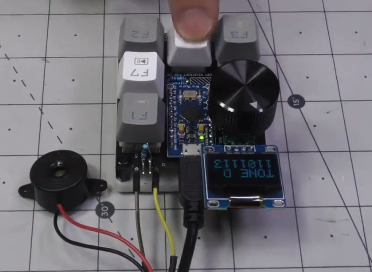

## Experimental Code

## Experimental Music Mode

ProMacro-6-music.ino allows you to connect a small speaker to GPIO pin 7 to play a number of notes.
Demo: https://twitter.com/JeremySCook/status/1423705079153139716

Amazon links are affiliate, meaning I get a small percentage of sales.
