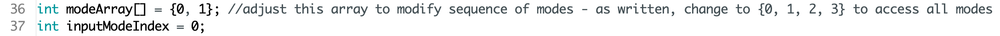
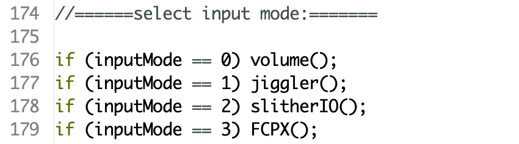

## Standard Code

Current standard code (ProMacroStandard.ino) is written and tested on a Macintosh -  
should work with a PC or Linux, possibly with some modifications.

Includes a mode for media control and browser tabbing, as well as a "jiggle" mode to keep your computer awake.
Switch modes by simultaneously pressing upper-right key, and the key directly below that.

Recently made some code changes, so LEDs are not tested as of now.

Note that after initial install, GND and RST pins may need to be shorted together  
momentarily after hitting upload in the Arduino IDE in order to reprogram.

Also, due to differences in manufacture, line 50:

Encoder myEnc(0,1); //if rotation is backwards, swap 0 and 1

may need to be swapped as noted

## Alternative Modes Slihter.io Mode & FCPX

Additional modes are included in the standard code and can be accessed by modifying the array shown below. Modes  
will switch from the 0 indexed number in the array, to the next one and so forth. So if you want your controller to  
go: volume-jiggle-slither, change it to {0, 1, 2}. volume-FCPX would be {0, 3}. All current modes would be {0, 1, 2, 3, 4}

In slither mode, align the mouse with the head of worm and press upper-right keyboard button. You can then steer the 
worm with the encoder and speed up with the three bottom buttons. There's also a "NASCAR" mode where the worm keeps
turning left.

In FCPX mode, encoder advances/rewinds frames, bottom buttons stop ffwd/rev, top right and below zoom in and out. Press
the encoder to break all clips. Great for trimming extra footage.
