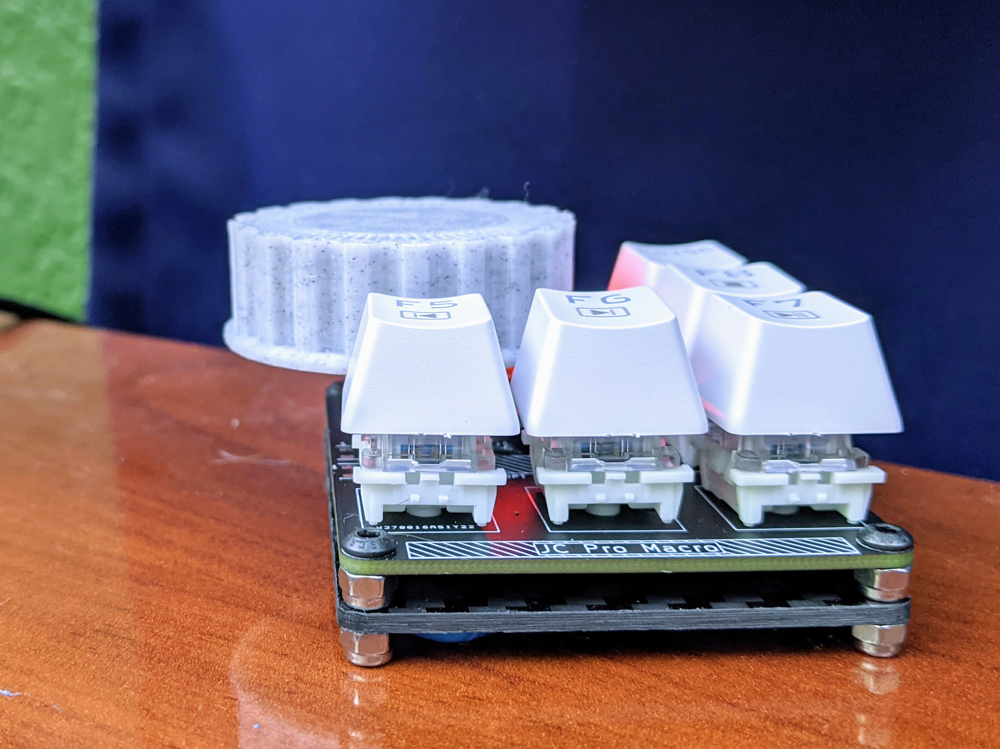

JC Pro Macro Model.step is the assembly 3D file that is openable in a variety of CAD packages.  
Not particularly "clean" but potentially good for reference if you want to build on the design.

**3D printed accessories for JCPM**

* 3DP-base - can be used as a base instead of standoffs and laser cut acrylic - may need work on tabs.
* Assembl-Jig - used to facilitate assembly of device
* Knob - 3D-printed knob for EC11 encoder
* PR-giganto-knob - as pictured below, made by [Pat Regan](https://twitter.com/patsheadcom) via [customizer](https://www.thingiverse.com/thing:2220561)

