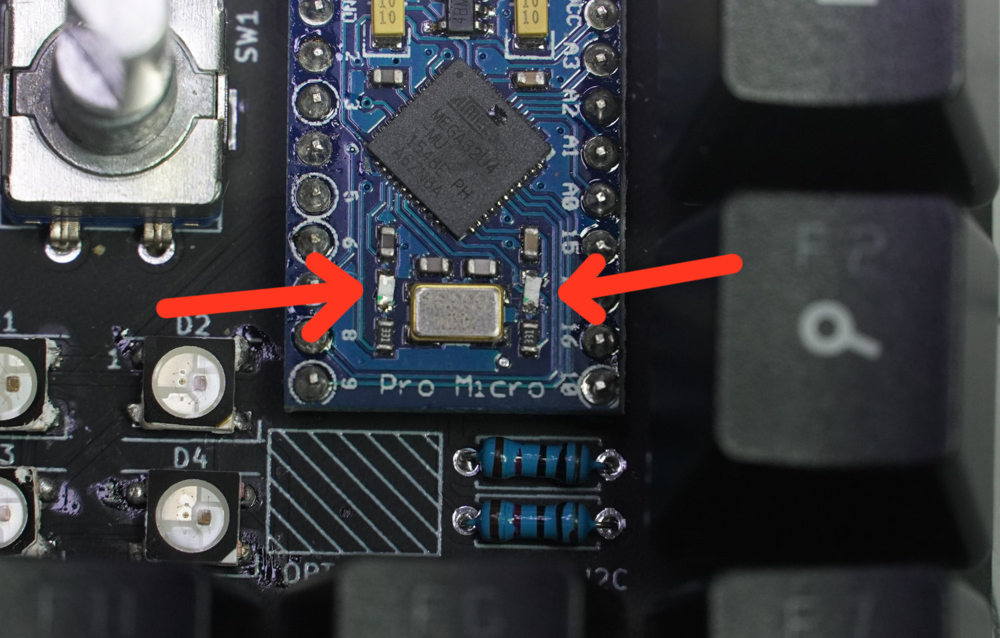

Items required:

JC Pro Macro Board [Tindie](https://www.tindie.com/products/24327)  
EC11 - style rotary encoder [Amazon](https://amzn.to/2UHf1wW)  
KeySwitches - [Amazon](https://amzn.to/3iFpGQH)  
"Arduino" Pro Micro - [Amazon](https://amzn.to/2UALftK)

Depending on preference, and for potentially better performance, user may choose to desolder  
or otherwise **disable LEDs** (or lack thereof) on the Pro Micro as shown below:

A variety of keyswitches and encoders will work, examples are provided for your reference.
The Pro Micro is available on Tindie, along with some other components.

As shown in the video, you can even take apart a keyboard to harvest parts if you like.

Amazon links are affiliate, meaning I get a small percentage of sales.
