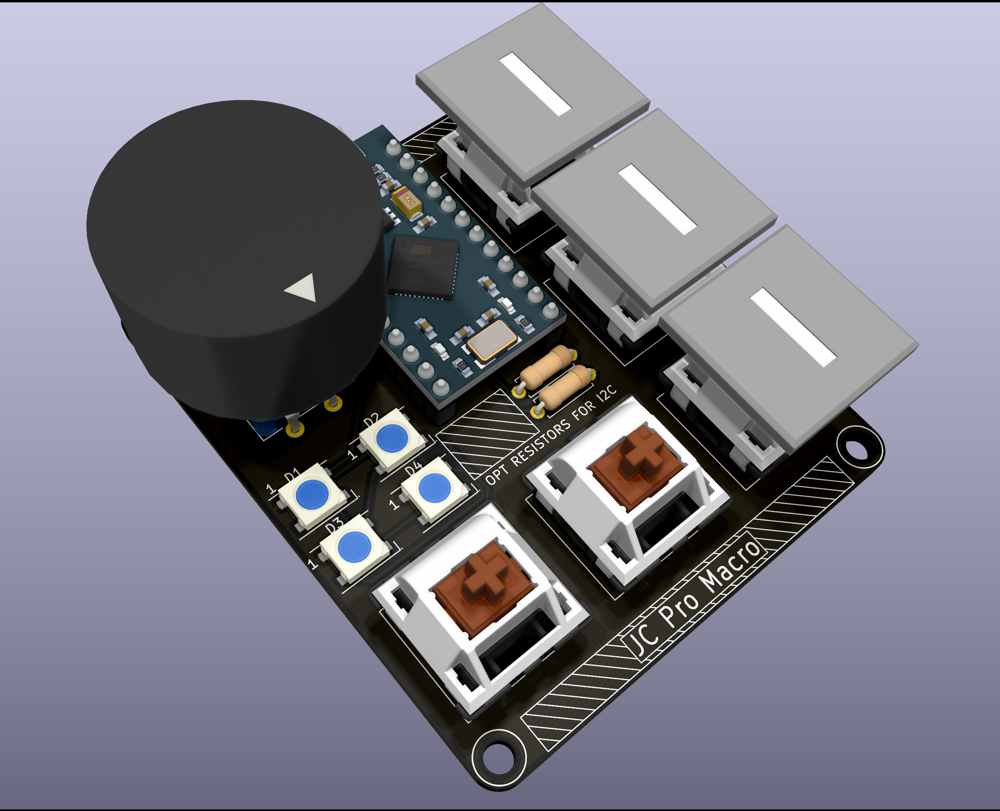
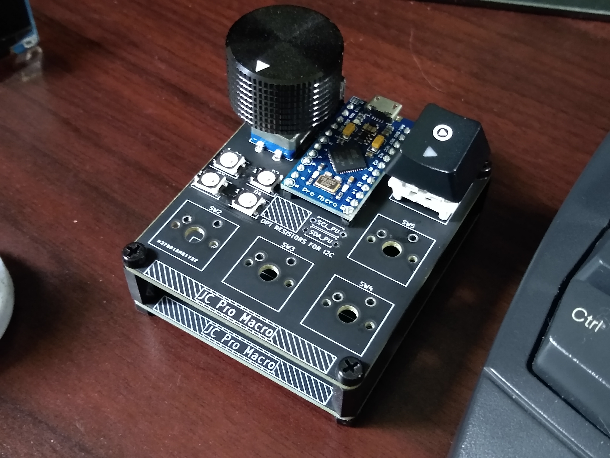

# JC-Pro-Macro

Macro keypad and rotary input based on the ATmega32U4 Pro Micro, as seen here: https://www.youtube.com/watch?v=8qgGteDjMGc

Includes rotary encoder, 5 keyboard-style switches, 4 RGB LEDs.

I2C pins are broken out and arranged for use with SSD1306-based OLED screens
Current program includes diagnostic code for this type of screen, the pins
could theoretically be used for anything.

More info to come!

Uses HID Project software by NicoHood: https://github.com/NicoHood/HID  
My previous rotary input project: https://github.com/JeremySCook/RotaryControl

https://twitter.com/JeremySCook/status/1414996190547042306
