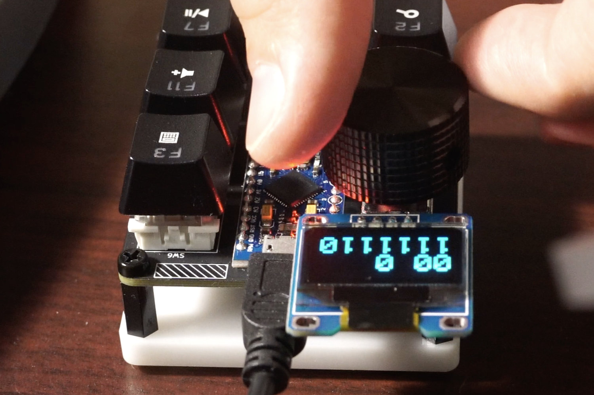

# JC-Pro-Macro

Macro keypad and rotary input based on the ATmega32U4 Pro Micro

# Videos:

Development:       https://www.youtube.com/watch?v=g-XJLiv03rI  
Assembly process:  https://www.youtube.com/watch?v=au07GKwa_J8

# Info

Available on Tindie: https://www.tindie.com/products/24327

I2C pins are broken out and arranged for use with SSD1306-based OLED screens  
Current program includes diagnostic code for this type of screen.  
2 additional GPIO pins, as well as GND and +5V are broken out, giving a total  
of 4 GPIO pins that can be used to control external devices (perhaps a small fan)

Uses HID Project software by NicoHood: https://github.com/NicoHood/HID  
My previous rotary input project: https://github.com/JeremySCook/RotaryControl
